# Making a Query

There are two main ways to query the ConnecTF database:
- Write the query in the text box provided. We imagine this will be the preferred method for researchers as they become comfortable with the syntax.
- Use the query builder to create the query. This is a great way to start if you are not familiar with the syntax.

## Searching for a Transcription Factor

Typing the name or ID of a transcription factor (TF) in the query search bar brings up a list of available TFs in the ConnecTF database.

Select the TF you are interested in and select "Submit". 

## Query Builder

### Adding Transcription Factors to a Query

For more complex queries, click **Add TF** to add one or more TFs to the query. Use **Add TF Group** plus drag-and-drop to arrange TFs into groups. Selecting **and** or **or** will query the target genes that form the intersection or union, respectively, of the TFs or TF Groups in the query.

The "Build Query" button will turn orange when it needs to be updated. Click on it to see the query in the textbox. Click on the the submit button to execute the query. You may choose to unselect the checkbox "Confirm Query Before Submit" so you don't get a popup to confirm the submission.

### Adding Metadata Filters to a Query

Constraits can be added to restrict the target genes returned by the query based on the metadata associated with an experiment. This is done by clicking on the **Add Filter** button and then selecting the desired metadata field from the dropdown menu and a value in the adjacent text box. Available values can be seen by clicking on the empty text box. Combinations of filters can be created with the **Add Filter Group** enabling complex filtering of TF-target gene datasets. Users familiar with the query syntax can add metadata filters to queries they type into the query search bar.  

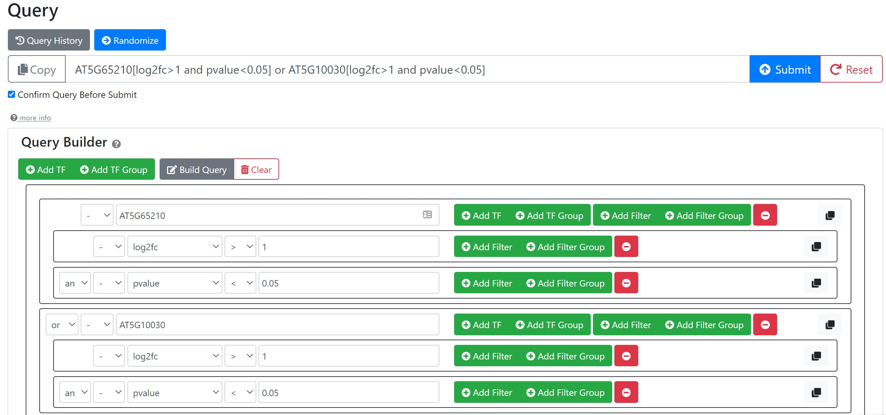

#### Generate Query Created in Query Builder

Click the **Build Query** button to populate the query search bar once all the desired TFs have been selected and grouped.

### Select Additional Edge Features

Additional directed and undirected TF-target interactions, including TF-TF protein-protein interactions and in vitro TF-binding (DAP-seq) filtered for open chomatin regions are included in ConnecTF. These interactions can be displayed as additional columns in the results table by selecting the desired edge type in the **Additional Edge Features** section. 

### Select a Target Gene List

The **Target Genes** allows users to limit the output of the TF targets to a user defined set of genes. Rather than returning all available TF-targeted genes, only the subset of the TF-targeted genes that are in the selected target gene list will be returned. This can be used to limit the output of the query to genes you are interested in, e.g. a pathway of interest. Users can upload a file containing a list of gene IDs.

Predefined target gene lists for the nitrogen by time response and hormone respones are available for selection. (See [Citations](/citations))

### Select Filter TFs

The **Filter TFs** limits the *TFs queried* to a user-selected list. This only affects queried TFs, and not its targets. Often used with the built-in keywords (see below) such as ***all_tfs*** to return the results for many TFs without having to enter each of them into the query search bar one by one.

### Select Target Network

The **Target Network** option uses the selected network to limit both queried transcription factors and their targets. Effectively limiting the output to the subset of the network provided.

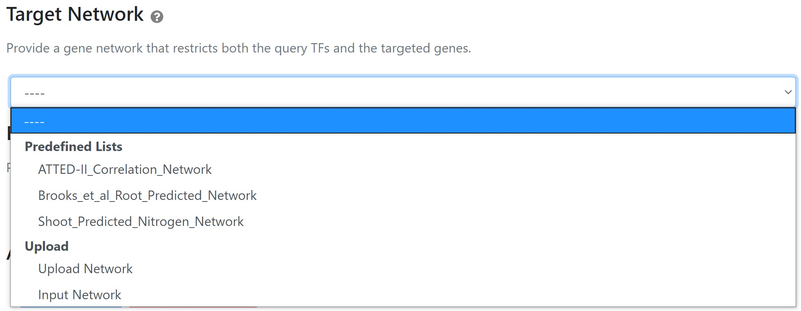

A predefined list of gene networks from separate experiments are also available for selection. (See [Citations](/citations))

### Background

Several of the analysis tools in ConnecTF report enrichment of the queried TF-target gene list(s) (see below). By default, all protein coding genes are used the background for these calculations. Users can input there own list of genes (e.g. all genes expressed under their experimental condition) for these calcuations using the **Background** option. 

## Built-in Keywords for Common Queries

Special keywords have been added that allow users to easily query commonly used sets TFs. These include:

***all_tfs***  - query *all* TFs in the ConnecTF database\
***multitype*** -  query TFs that have more than one "Experiment_Type" in the metadata\
***all_expression*** - short hand query for "all_tfs[EXPERIMENT_TYPE = Expression]", returns all RNA-seq/microaray experiments\
***in_planta_bound*** - short hand query for "all_tfs[EDGE_TYPE = in planta:Bound]", returns all binding experiments done in planta\
***all_dap*** - short hand query for "all_tfs[EDGE_TYPE = in vitro:Bound:DAP or EDGE_TYPE = in vitro:Bound:ampDAP]", returns all DAP-seq binding experiments

*Caution!* Queries generated using these shortcuts can easily return a large number of TF experiments which could result in long wait times.

## Advanced Queries

### Query Expansion

A special ***expand()*** function has been added that allows more complex queries to be applied to a set of TFs which are specified in the **Filter TFs** (or **Target Network**) box. 

The basic syntax is:

*expand(query, operator)*

To demonstrate, for the following query and list of TFs:

*expand("$filter_tf[log2fc < 0] and $filter_tf[EDGE_TYPE='in planta:Bound]", or)*

*Filter TFs:\
AT5G65210\
AT4G24020*

A query is built by replacing each occurence of **$filter_tf** with the TFs in the list one by one, and combining them using the chosen operator (**and** or **or**). The above example would be equivilent to:

*(AT5G65210[log2fc < 0] and AT5G65210[EDGE_TYPE='in planta:Bound]) or (AT4G24020[log2fc < 0] and AT4G24020[EDGE_TYPE='in planta:Bound])*

---

# Results

Once the query is submitted, the first screen that is presented is the **Summary** of the results. The different tabs in the results is based on the original query and filters that were applied. 

## Summary

One the top right of the results there are 4 different buttons:
- Show/Hide Analysis - Select analysis to include
- Show Query - The query that was submitted in the textbox
- Back - back to the query page with form already selected
- New Query - Start a new query from scratch. 

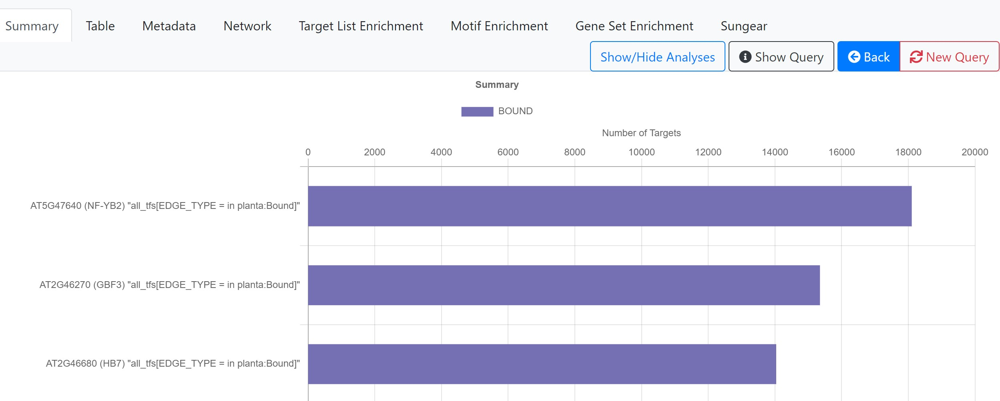

Summary includes a horizontal bar chart detailing the number of targets per experimental analysis for each TF. If there are greater than 50 TFs queried, only top 50 by total target count will be displayed.

## Table

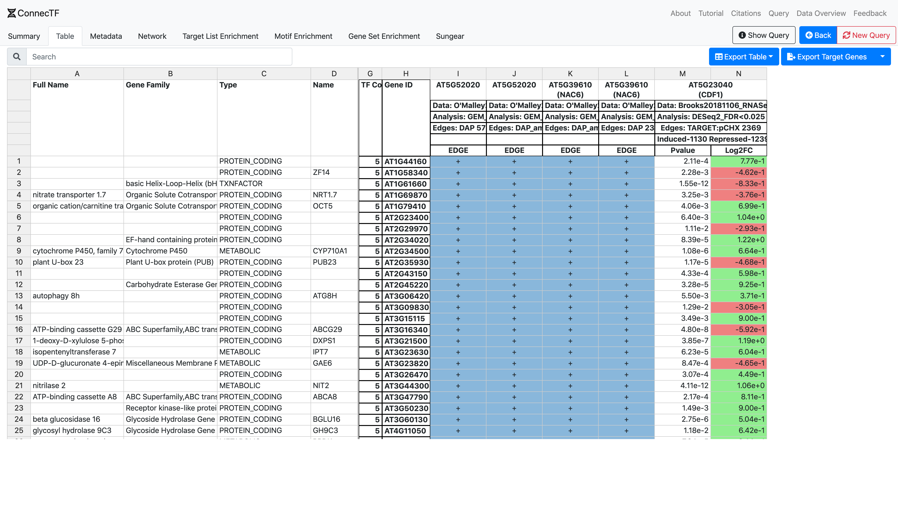

Displays all of the target genes of each analysis. If *P*-values and Log2 fold change are available they will be displayed. A "**+**" sign will be displayed if no *P*-value and Log2 fold change is available for that analysis. The table can be exported as an Excel or CSV file. The combined list of target genes from the query can be exported as a text file, copied to the clipboard, or saved as a temporary list within ConnecTF that the user can then use to filter TFs or targets in subsequent queries.

## Metadata

Metadata for each analysis returned by the query is displayed here and can be exported as a CSV file.

## Network

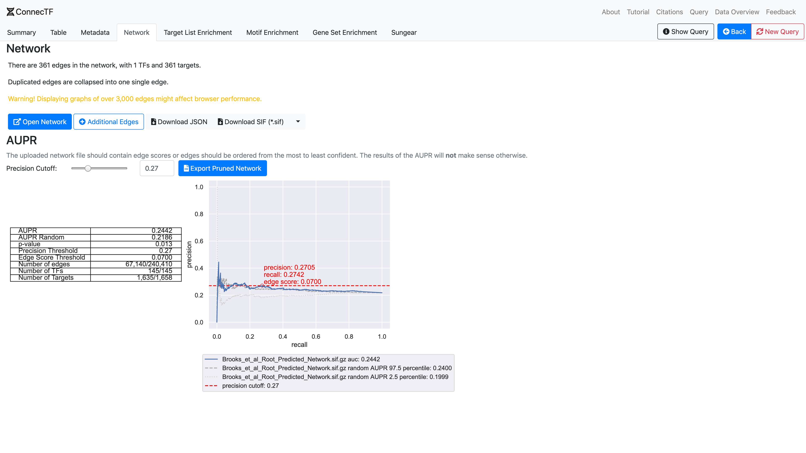

### Summary, Export, and Link to Graph View

A summary of the network is included along with a link to the [Network Graph](#network-graph). An overview of how many edges, transcription factors, and targets are presented. There are also options to export the network as a [SIF](https://manual.cytoscape.org/en/stable/Supported_Network_File_Formats.html#sif-format) or JSON file, which you can open with [Cytoscape](https://cytoscape.org).

### Network Graph

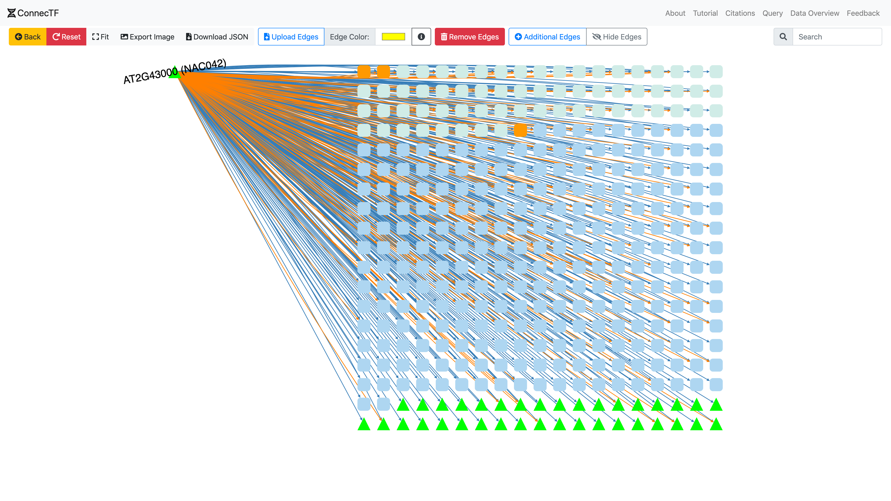

*Network Graph will be slow and will impact overall browser performance if the network has too many edges.*

Queried TFs are displayed as a group on the left side, with target genes on the right side, grouped by the number of targeting TFs.

Additionally, you can upload a list of edges to be displayed along with the current network with the "**Upload Edges**" button. Note that user uploaded edges will only connect existing genes in the network. No new genes will be placed in the network.

### AUPR — (Area Under Precision Recall)

If a [Target Network](#select-target-network) is selected/uploaded during the query, an auotmated precision/recall analysis is performed and AUPR for the predicted/inferred network is reported using the validated edges from the query results. A precision cutoff can be selected using the slide bar or text box to refine/prune the network and the table will auotmatically be updated to display the results.   

*This feature only appears if a [Target Network](#select-target-network) is selected during query. **A ranked network is required**, otherwise the results will be meaningless*

## Target List Enrichment

All the queried analyses will be checked against [uploaded gene list](#select-a-target-gene-list) or [uploaded network](#select-target-network) for enrichment.

Enrichment is calculated using a Fisher's exact test to check for significant overlap between the validated TF-targets returned by the query and the selected target gene list(s). The user can toggle between *P*-value, specificity (percent of TF-target genes in the selected target list) or influence (percent of genes in the selected target list regulated by the TF). All *P*-values are FDR corrected using the Bonferroni correction.

The heatmap presents similar information as the table but provides a graphical representation.

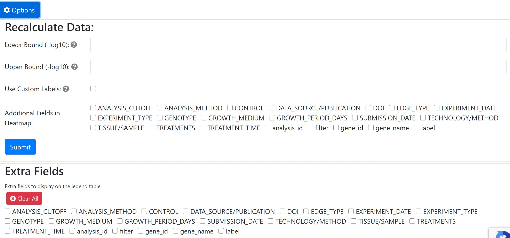

The options tab above the results can be used to :
- Adjust the color range for the heatmap
- Add additional fields to the table
- Add extra fields to the heatmap

## Motif Enrichment

### Motif Cluster Table

For each TF analysis returned by the query, the 500 bp promoter region of the TF-target genes will be checked for enrichment of any of 80 cis-motif clusters from Brooks et al 2019 (See [Citations](/citations)). By default, a *P*-value cutoff (alpha) of 0.05 is used and only clusters that are enriched in at least one TF-analysis are displayed. All *P*-values are FDR corrected using the Bonferroni correction.

Enrichment is also shown for any selected target gene list or network. FDR correction on these is done independently of the validated TF-target analyses returned by the query. 

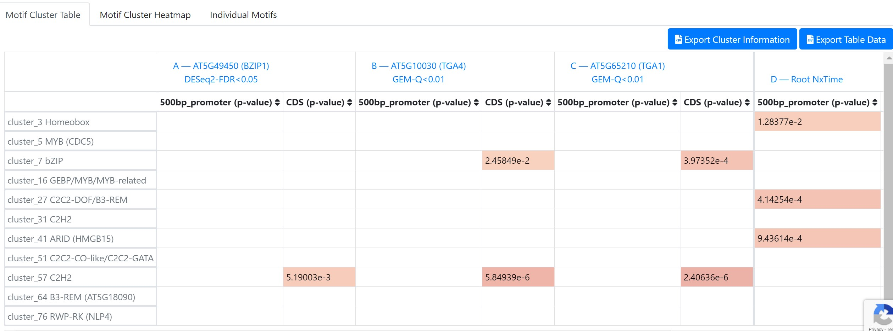

### Individual Motifs

ConnecTF also contains 1310 cis-motifs for 730 Arabidopsis TFs collected from Cis-BP (See [Citations](/citations)). Enrichement of each of these experimentally validated TF cis-motifs in the queried TF-target analyses can calculated in this tab. By default, only the cis-motif(s) for the TF itself will be calculated, but users can use the *Select Motifs* button to calculate enrichment of any of the other motifs in the targets of a specifc TF analysis, or use the *Add/Remove Motifs* button to select a cis-motif for all queried analyses

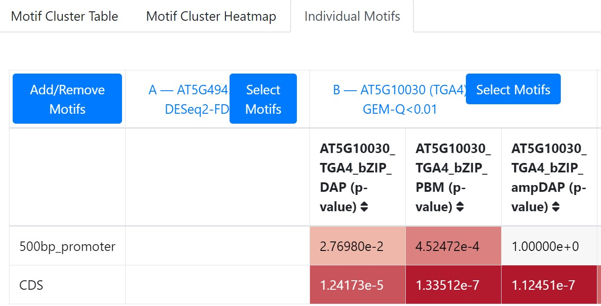

### Changing the Cutoff and Geneic Region 

The *Options* button at the top of each of the motif enrichment tabs can be used to adjust the *P*-value cutoff (alpha) or select other geneic regions (e.g. 1000bp promoter, 5'UTR, CDS etc.). 

## Gene Set Enrichment

Gene set enrichment is the pairwise significance of overlap between all the analyses queried using the Fisher's exact test. The coordinates on the grid, with each row and column representing a different analysis, indicate which analyses the cell represents, and the shading color indicates the significance off overlap. A darker color indicates an increased significance of overlap.

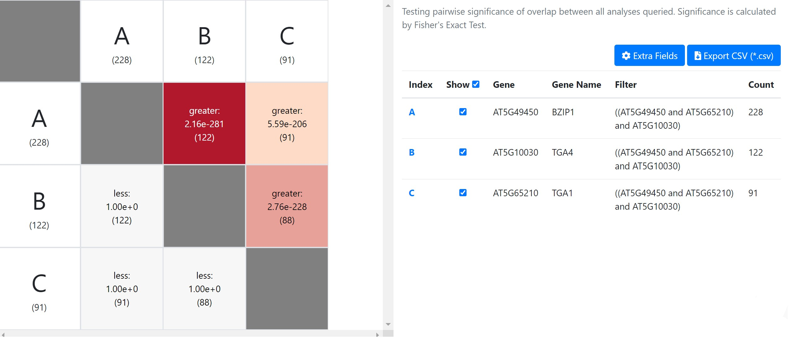

## Sungear

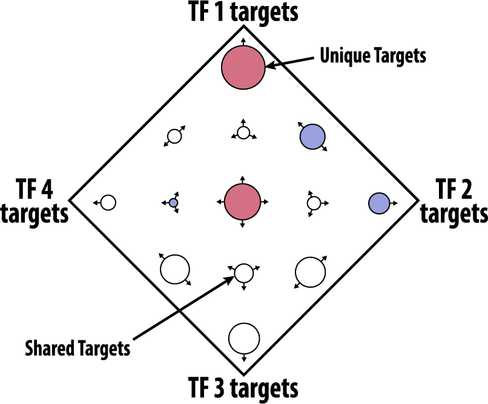

Sungear, orginally published by [Poultney *et al*](/citations#tools), is an interactive tool to display/visual overlaps between gene lists resulting from different queries, similar to a Venn diagram.  

Vertices on the outer polygon are anchor points, one for each TF-target analysis queried. Circular nodes represents non-overlapping gene sets that are in common between combinations of analyses. Each node has one or more arrows pointing to the vertices corresponding to the analyses which contains the genes. 

The *P*-values indicate whether a node contains greater or fewer genes than expected given the total number of targets regulated by each of the queried analyses.
